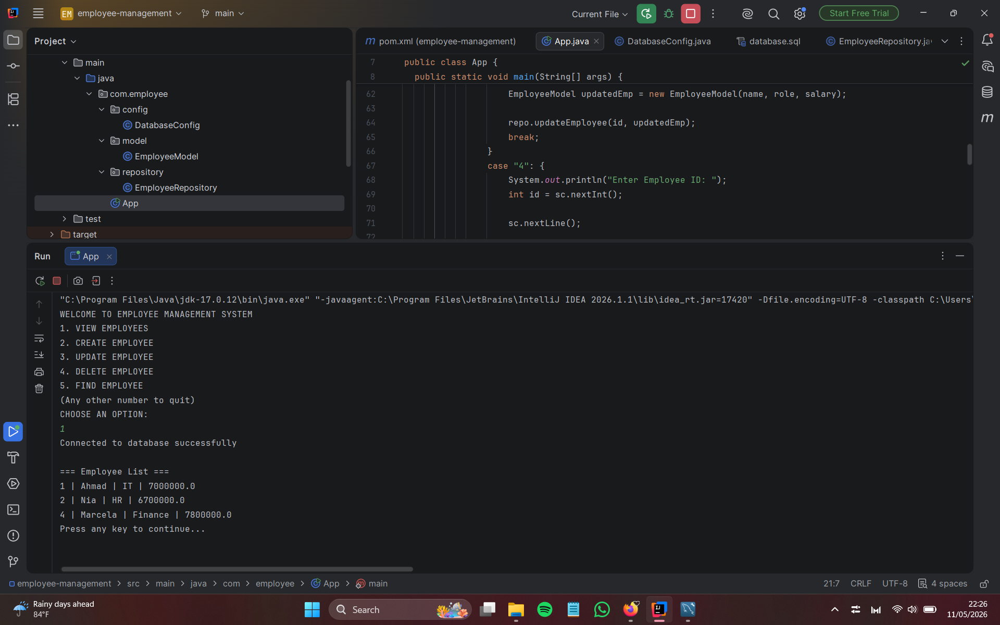
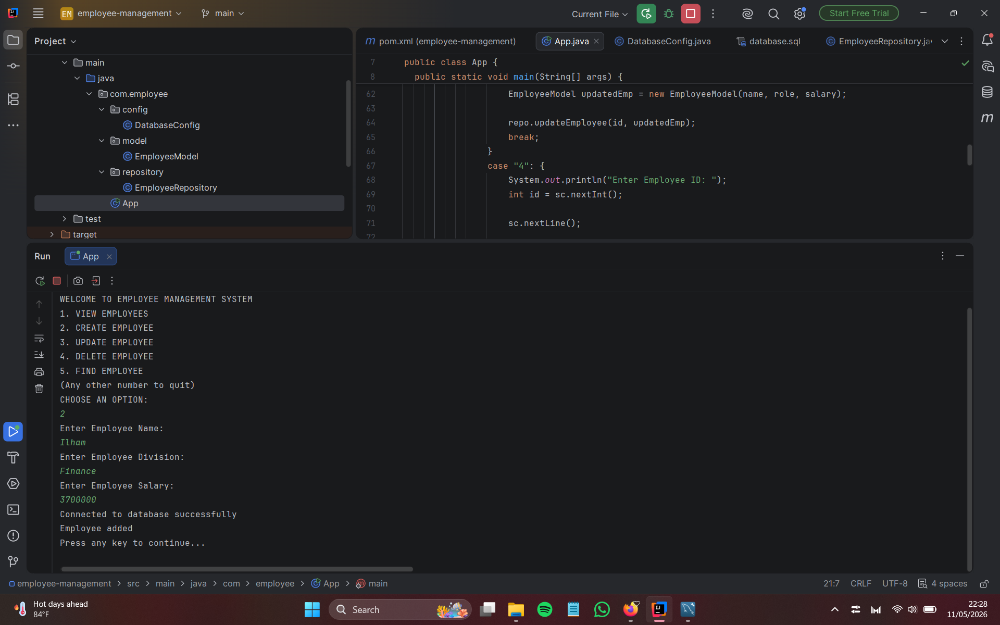
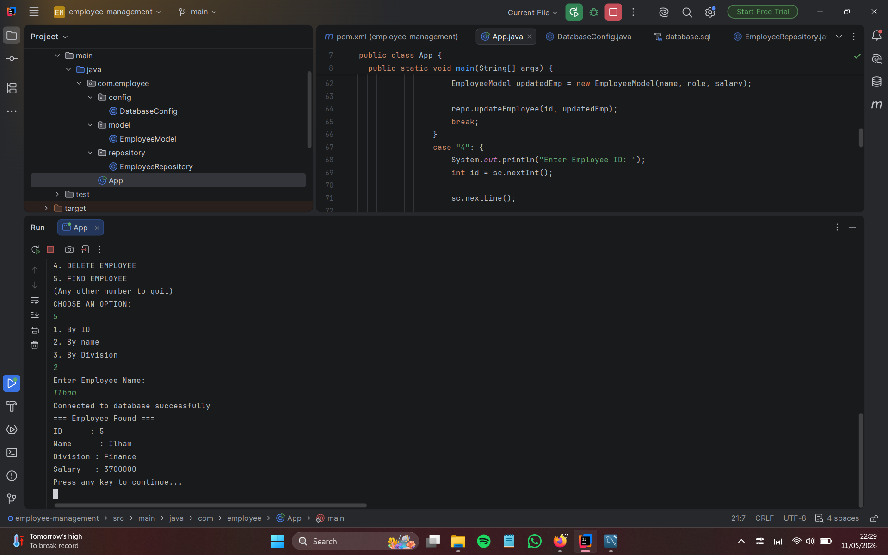
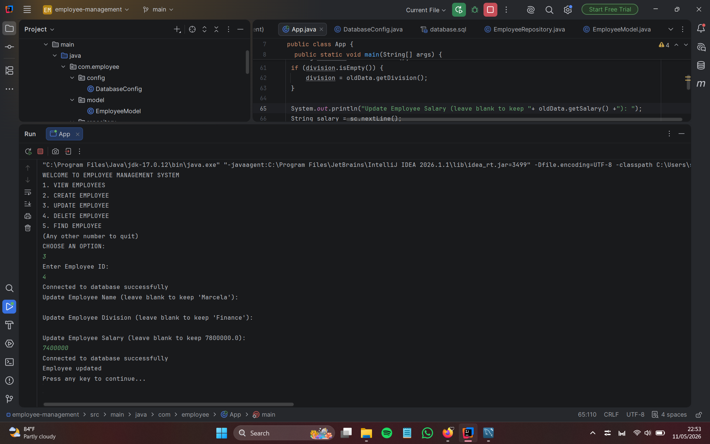
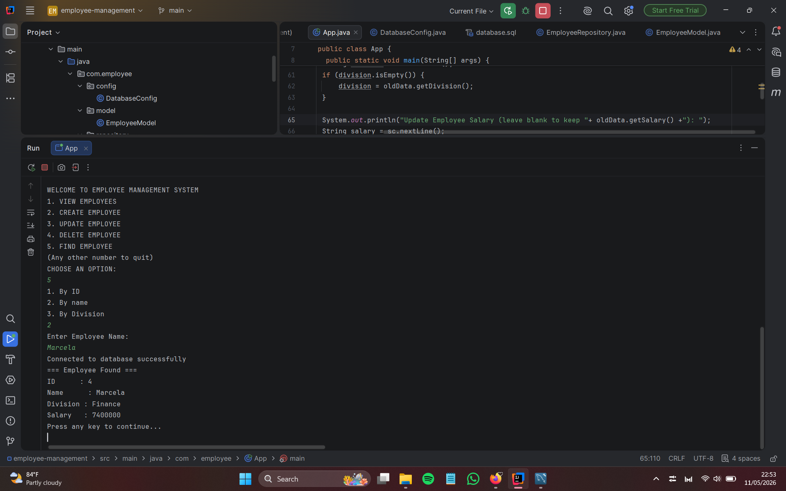
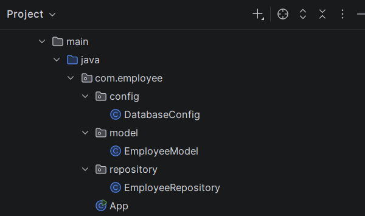

# Employee Management System

A simple Java console-based CRUD application for managing employee data using Maven, JDBC, and MySQL.

## Features

1. VIEW EMPLOYEES
- viewing all employees:

3. CREATE EMPLOYEE
- creating a new employee:

- a new employee has been added

3. UPDATE EMPLOYEE
- updating existing employee (you can leave blank to keep old data):

- an employee data has been updated:

4. DELETE EMPLOYEE
5. FIND EMPLOYEE (by id, name, or division)

## Tech Stack

- Java 17
- Maven
- MySQL
- JDBC
- DAO / Repository Pattern
- Console-based UI

## Structure

src/
- config/ # Database configuration
- model/ # Employee model class
- repository/ # Database operations (DAO)
- main/ # Main application (App.java)

## How to run

1. Clone repository
2. Open in IntelliJ IDEA
3. Make sure MySQL is running
4. Import database => Run database.sql
5. Run application (run App.java)

MORE FEATURES TO COME! Thanks
